<div align="center">
  
  <h1>rampart 🪞</h1>
  <p><em>Order-book depth the protocol itself will not let you withdraw.</em></p>
  

  <p>
    A resting order on <strong>Somnia</strong> Shannon (chain 50312), built on <strong>DreamDEX</strong>'s
    binary event-contract pools, whose owner is a contract with no cancel path — so the pool refuses
    <strong>the very wallet that paid for it</strong>. The centrepiece is a transaction that
    <strong>failed</strong>, permanently on a public chain:
    <a href="https://shannon-explorer.somnia.network/tx/0x959b47704d493dd48f2e724f2692facf1609a2cdc738f1a7ceb1fd070b3c6ddb"><code>0x959b4770…6ddb</code></a>
    (status <code>0x0</code>). <strong>93 tests, 0 failures, <code>src/</code> at 100% coverage.</strong>
    Reproduce it with no wallet and no gas — see <a href="#-live-deployment">Live Deployment</a>.
  </p>

  <p>
    <strong>Judges — start here:</strong>
    <a href="https://github.com/edycutjong/rampart">Repo</a> ·
    <a href="https://rampart.edycu.dev/viewer/">Typed-book viewer</a> ·
    <a href="https://youtu.be/DhxuWFHOsyM">Demo video (2:44)</a> ·
    <a href="DEMO.md">Evidence trail</a> ·
    <a href="SDK_FEEDBACK.md">SDK &amp; docs feedback (12 findings)</a> ·
    <a href="https://dorahacks.io/buidl/48111">BUIDL #48111</a>
  </p>

  <br/>

  [](https://rampart.edycu.dev)
  [](https://rampart.edycu.dev/viewer/)
  [](https://rampart.edycu.dev/pitch/)
  [](https://youtu.be/DhxuWFHOsyM)
  [](https://dorahacks.io/hackathon/event-contracts)
  [](https://dorahacks.io/buidl/48111)

  <br/>

  
  
  
  
  
  [](https://opensource.org/licenses/MIT)
  [](https://github.com/edycutjong/rampart/actions/workflows/ci.yml)
  [](https://github.com/edycutjong/rampart/releases/latest)

</div>

---

## 📸 See it in Action

<p align="center">
  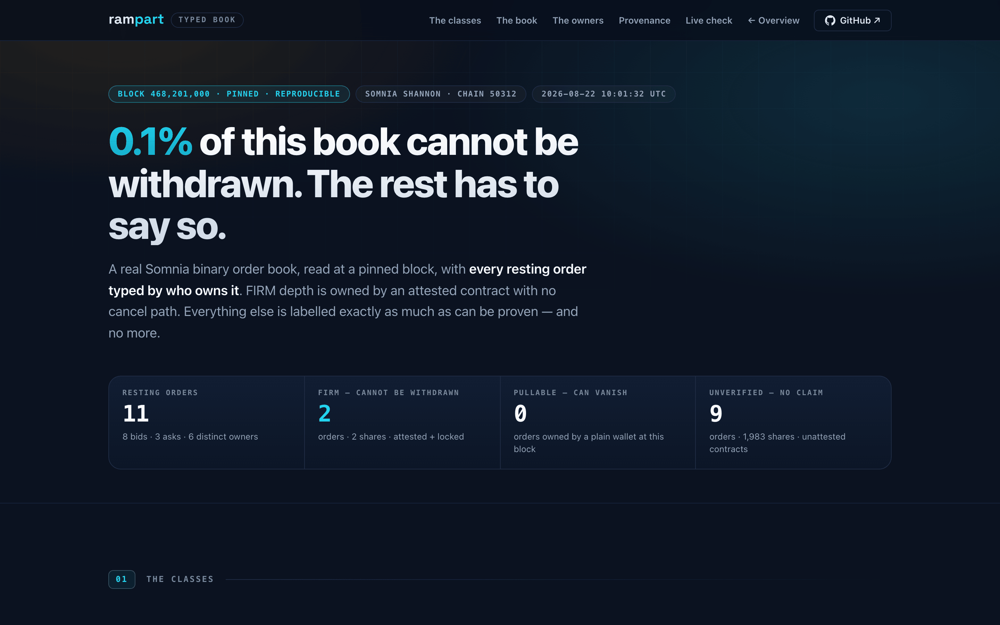
</p>

<p align="center">
  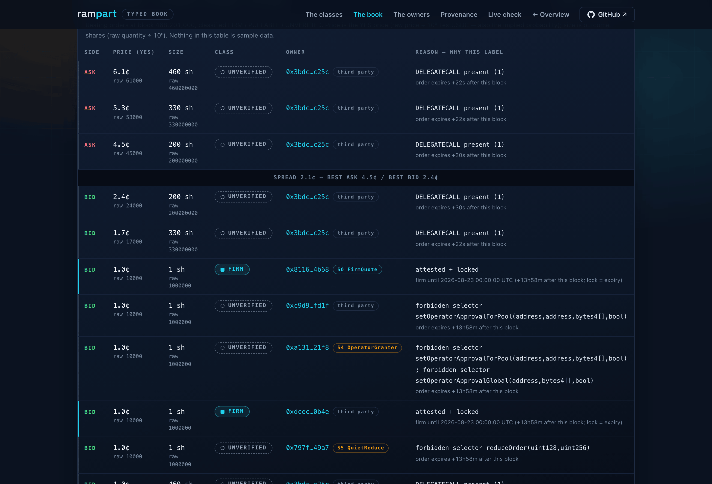
  <br><em>The <strong>reason</strong> column is the product; the badge is only its summary.</em>
</p>

<p align="center">
  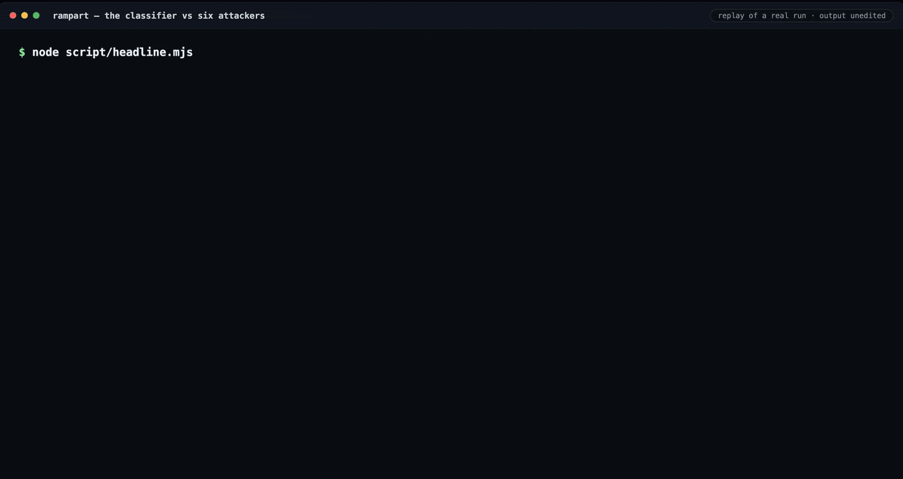
  <br><em>One command, offline and deterministic: the same answer on any machine.</em>
</p>

<p align="center">
  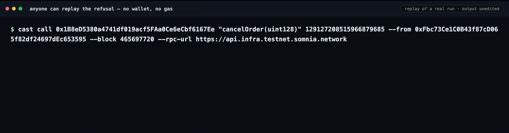
  <br><em>Anyone can replay the refusal — no wallet, no gas. The pool names both parties in its own revert data.</em>
</p>

**[rampart.edycu.dev/viewer](https://rampart.edycu.dev/viewer/)** — or open it locally, no server required:

```bash
open site/viewer/index.html      # no server, no build step, no network required
```

A self-contained page that renders a **real** Somnia book with every level typed. It ships a snapshot
pinned to block `468201000` — 11 resting orders, 2 FIRM, **0.1% of displayed depth cannot be
withdrawn** — the same numbers `node script/firmness.mjs --block 468201000` prints, from the same
engine. Every row carries the *reason* for its class (`DELEGATECALL present (1)`,
`forbidden selector setOperatorApprovalForPool(…)`, `attested + locked`), not just a badge.

`UNVERIFIED` is drawn as a **no-claim** state — dashed outline, hollow glyph, and the words "Claim:
none" — deliberately not as a negative one. Class is never carried by colour alone.

A **Live check** button re-reads the pool at `latest` from your browser and reclassifies. Run it today
and it will honestly report an empty book: the testnet pool has cycled, and `0%` over zero orders is
vacuous, not a finding. The page says exactly that rather than showing you a zero.

Regenerate the snapshot at any block: `node site/viewer/make-snapshot.mjs --block <n>`.

---

## 💡 The Problem & Solution

### The Problem

On every exchange on earth, displayed depth is a **promise**. The market maker showing you a bid can
pull it the moment you need it most, and you have no way to tell in advance which levels will hold.

Typing a level as firm because `EXTCODESIZE(owner) > 0` does not fix this — it is **forgeable**. A
contract can hide a cancel, sit behind an upgradeable proxy, `DELEGATECALL` to an attacker target, or
grant an operator *after* resting. All four display as FIRM under a naive check and are fully pullable,
which is worse than no signal: it launders unreliable liquidity through your own metric.

### The Solution

A `FirmQuote` contract holds collateral, approves a Somnia `BinaryPool`, and calls
`placeBinaryOrder` — so the resulting **`Order.owner` is the contract, not a wallet**.

The contract exposes **no cancel path, no reduce path, and never grants an operator**. Every route
that could withdraw the resting order is therefore closed:

| Withdrawal path | Who may call it | Source |
|---|---|---|
| `cancelOrder(uint128)` | the order owner **only** — a non-owner reverts `IncorrectSender` `0xf5e39c1f` | [errors](https://docs.dreamdex.io/developers/contracts/errors) |
| `cancelOrderFor(owner, id)` | an operator the **owner** approved. *"Unlike `placeOrderFor`, the system-contract allowlist does **not** admit callers here — only the owner's per-user approval does."* | [functions](https://docs.dreamdex.io/developers/contracts/functions) |
| `reduceOrderFor(owner, id, qty)` | *"Per-user approval only (no system allowlist)."* | [functions](https://docs.dreamdex.io/developers/contracts/functions) |

The quote stands until a taker fills it or its mandatory `expireTimestampNs` lapses. **Not even the
wallet that paid for it can take it back.**

### Why that matters

`Order.owner` is readable on-chain, so every price level can be **typed**:

| | condition | claim |
|---|---|---|
| **FIRM** | owner is a contract whose `EXTCODEHASH` is attested, still inside its lock window | this depth cannot be withdrawn |
| **PULLABLE** | owner is a wallet | this depth can vanish in one block |
| **UNVERIFIED** | owner is a contract we have not attested | *no claim is made* |

"Percent of book that cannot be withdrawn" is a liquidity-quality observable that **exists on no
other exchange**. Off-chain books — Polymarket, Kalshi, every CEX — cannot expose it: their resting
orders are signed messages inside a private matching engine, with no on-chain owner to inspect.

> `UNVERIFIED` is load-bearing. Under our policy the four forgeries above mint UNVERIFIED depth
> instead of FIRM, and UNVERIFIED makes no claim.
>
> **What that is not:** a proof of irrevocability. `FIRM` means *attested and inside its lock window*,
> and attestation is a human-reviewed transparency list — `analyze()` is the pre-filter that rejects
> the obvious escapes, never the sole gate. A selector built arithmetically at runtime evades any
> static scan, so a green `analyze()` is a precondition for review, not a substitute for it. See
> [Honest limits](DEMO.md#honest-limits).

---

## 🏗️ Architecture & Tech Stack

<p align="center">
  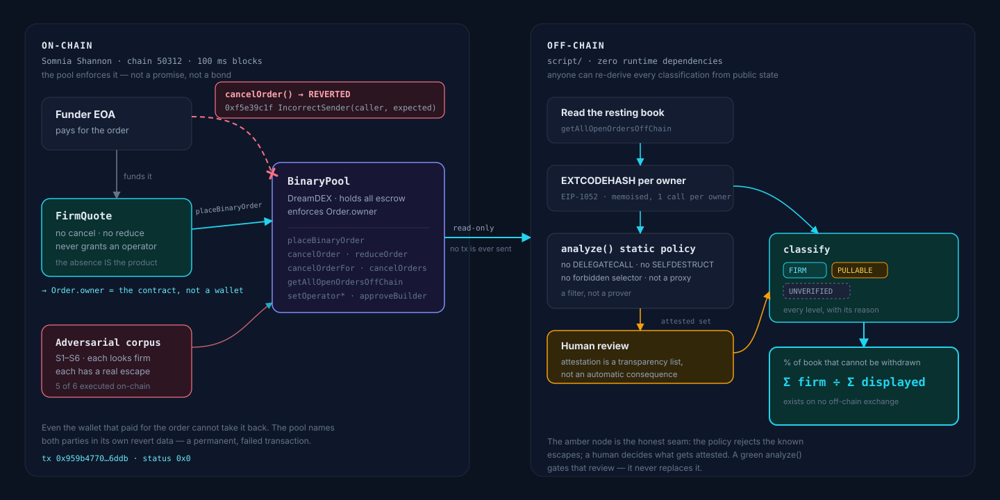
</p>

<details>
<summary>Same diagram as mermaid source</summary>

```mermaid
flowchart LR
    subgraph CHAIN["Somnia Shannon · chain 50312 · 100 ms blocks"]
        EOA["Funder EOA<br/>pays for the order"]
        FQ["<b>FirmQuote</b><br/>no cancel · no reduce<br/>no operator grant"]
        POOL["<b>BinaryPool</b><br/>holds all escrow<br/>enforces Order.owner"]
        ADV["Adversarial corpus S1–S6<br/>each looks firm,<br/>each has a real escape"]
    end

    subgraph ENGINE["script/ — off-chain engine, zero runtime deps"]
        BOOK["read the resting book<br/><i>getAllOpenOrdersOffChain</i>"]
        CODE["EXTCODEHASH per<br/>distinct owner"]
        POLICY["<b>analyze()</b> static policy<br/>no DELEGATECALL · no SELFDESTRUCT<br/>no forbidden selector · not a proxy"]
        HUMAN{{"human review<br/>— the policy is a filter,<br/>not a prover —"}}
        SET["attested code-hash set"]
        CLS["<b>classify</b><br/>FIRM · PULLABLE · UNVERIFIED"]
        PCT["<b>Σ firm ÷ Σ displayed</b><br/>% of book that<br/>cannot be withdrawn"]
    end

    EOA -->|"funds, then CANNOT cancel<br/>IncorrectSender 0xf5e39c1f"| FQ
    FQ -->|placeBinaryOrder| POOL
    ADV -->|placeBinaryOrder| POOL
    POOL --> BOOK --> CODE --> CLS
    CODE --> POLICY --> HUMAN --> SET --> CLS
    CLS --> PCT

    style FQ fill:#0b3d3d,stroke:#22d3ee,color:#e6fbff
    style POOL fill:#1e1b4b,stroke:#818cf8,color:#eef2ff
    style ADV fill:#3f1d2e,stroke:#fb7185,color:#ffe4e6
    style PCT fill:#0b3d3d,stroke:#22d3ee,color:#e6fbff
    style HUMAN fill:#3d2f0b,stroke:#fbbf24,color:#fffbeb
```

</details>

The **left half runs on-chain and is what the proof rests on**: the pool refuses the funder because
`Order.owner` is a contract with no code path to ask. The **right half is off-chain and read-only** —
it never sends a transaction, so anyone can re-derive every classification from public chain state.
The amber node is the honest seam: `analyze()` rejects the known escapes, a human decides what gets
attested. See [Honest limits](DEMO.md#honest-limits).

| Layer | Technology | Why |
|---|---|---|
| Contracts | Solidity 0.8.28 · Foundry | `cancun` target, so EIP-6780 closes the `SELFDESTRUCT` escape at the EVM level |
| Chain | Somnia Shannon (50312) | 100 ms blocks are what make *live* full-book retyping plausible |
| Protocol | DreamDEX `BinaryPool` · ERC-6909 | the pool holds all escrow and enforces `Order.owner` — that enforcement IS the product |
| Off-chain engine | Node ≥ 20, **zero runtime deps** | hand-rolled keccak-256 + raw JSON-RPC, so anyone can re-derive a classification |
| Sponsor SDK | `@somnia-chain/markets-sdk` (**dev** dep) | CI-only differential against the hand-transcribed ABI — see below |
| Verification | halmos · Foundry invariants · Slither · CodeQL | the security property is an *absence*, so it is attacked three ways |

---

## 🏆 Somnia × DreamDEX Integration

The off-chain engine has **no runtime dependencies**: it hand-rolls keccak-256 and speaks raw
JSON-RPC, so anyone can re-derive a classification with nothing but Node and a public endpoint.

That buys verifiability and costs a risk: a hand-transcribed ABI rots silently. A `uint256` where the
pool wants a `uint96` produces a **different function selector**, and the call reverts with nothing
decodable. We hit exactly that during the build.

So `@somnia-chain/markets-sdk` is a **dev** dependency, and `script/sdk-verify.mjs` is the bridge —
the shipped engine stays dependency-free while CI proves the hand-written surface still agrees with
the sponsor's own source of truth:

```bash
npm run sdk-verify     # 35/35 — included in `npm run verify`
```

| It checks | Against |
|---|---|
| `placeBinaryOrder`'s exact 9-arg signature, and that the `uint256` variant does **not** exist | `binaryPoolWriteAbi` |
| all 7 `FORBIDDEN_SELECTORS` are the true keccak of the signatures we claim | our own keccak, re-derived |
| `CANCEL_ORDER_FOR_SELECTOR` = `0xe37b444b` | the SDK constant — also the constant in `test/Adversarial.t.sol` |
| the buy-side-only invariant `kind ∈ {0, 2}` | the SDK's `ORDER_KIND.BUY_YES` / `BUY_NO` |
| the pool really exposes `cancelOrder` / `reduceOrder` / `approveBuilder` | `binaryPoolWriteAbi` |
| the enum values `FirmQuote` hardcodes: `orderType 0` still rests, and `selfMatchingOption 0` still cancels the **taker** (if it meant maker, the depositor could erase its own "irrevocable" quote by self-crossing) | `ORDER_TYPE` / `SELF_MATCHING_OPTION` |
| `IncorrectSender` = `0xf5e39c1f`, **and that `(sender, expected)` is the word order** the proof decodes | the SDK's shipped error ABI |
| the book reader's selector and the exact 8-field `Order` layout it decodes by word offset | the shipped `readsAbi.ts` |
| the ERC-6909 `setOperator` our policy bans is the sponsor's own | `erc6909Abi` |

A passing run also re-verifies **our keccak** against the sponsor's published selector constants —
the hash implementation and the ABI transcription check each other.

It reports two things it *cannot* verify rather than passing them silently: four forbidden selectors
absent from the SDK's curated write ABI (reached directly on-chain — S6 does exactly that), and
`PLACE_ORDER_FOR_SELECTOR`, which the package exports **without any ABI entry that would let a
consumer derive it**. That last one is filed as finding 9 in our SDK feedback report.

### Notes for anyone building on Somnia binary markets

Two things cost real time and neither is in the prose docs, which document `SpotPool`:

1. **A binary pool has `placeBinaryOrder`, not `placeOrder`.** The generic entry point reverts
   `UseBinaryPlacement`. The YES/NO side is an explicit `kind` param and `price` is *always* quoted
   in YES terms.
2. **`builderFeeBpsTimes1k` must be `uint96`.** It is selector-critical — a `uint256` there produces
   a different function selector and the call reverts with nothing decodable.

Both were read out of `markets-sdk/src/tradeAbi.ts`, not the documentation.

### Use it in your own project

The engine is packaged — 23.2 kB, 11 files, **zero runtime dependencies**:

```bash
npm install github:edycutjong/rampart
```

```js
import { analyze, attestedClassify, readBook, selectorOf } from 'rampart-firm-book';
```

Subpath exports (`rampart-firm-book/analyzer`, `/keccak`, `/classify`, `/book`, `/rpc`) are available
if you want one piece. Runnable examples and the honest limits are in
[`script/lib/README.md`](script/lib/README.md). **Not published to npm** — install from the repo.

---

## ⛓️ Live Deployment

### ✅ The gate passed — 2026-08-19

A `BinaryPool` accepts a contract as `Order.owner`, and the funder cannot take the order back.
Order `…9685` rested with real escrow while its own funder's cancel **reverted**:

```
0xf5e39c1f  IncorrectSender(
  caller   = 0xFbc73Ce1…3595   ← the wallet that paid for the order
  expected = 0x2a09b4c4…191a   ← FirmQuote
)
```

The failed transaction is public and permanent:
**[`0x959b4770…6ddb`](https://shannon-explorer.somnia.network/tx/0x959b47704d493dd48f2e724f2692facf1609a2cdc738f1a7ceb1fd070b3c6ddb)** (status `0x0`).
Control: the same call `--from` the contract returns `0x` — the pool *would* allow its owner to
cancel; the owner simply has no code path to ask.

Full evidence, including why the first attempt was invalid and was re-run: **[DEMO.md](DEMO.md)**.

Verify it yourself with no wallet, no funds, no gas:

```bash
cast call 0x1b8ed5380a4741df019acf5faa0ce6ecbf6167ee "cancelOrder(uint128)" \
  129127208515966879685 --from 0xFbc73Ce1C0B43f87cD065f82df24697dEc653595 \
  --rpc-url https://api.infra.testnet.somnia.network
# → execution reverted, data: 0xf5e39c1f…  ← IncorrectSender. The pool refuses the funder.
```

> **Read the returned data carefully — we would rather you did.** `0xf5e39c1f` is
> `IncorrectSender(address,address)`. Run without a block pin *today* and the decoded `expected`
> field is `0x00…00`: the right selector, but the weak proof ("no such order"), because that order
> has since expired out of the book.
>
> **Add `--block 465697720` for the strong decode** — Somnia's public RPC is archival, so this works
> against the same endpoint:
>
> ```bash
> cast call 0x1B8eD5380a4741df019acf5FAa0Ce6eCbf6167Ee "cancelOrder(uint128)" \
>   129127208515966879685 --from 0xFbc73Ce1C0B43f87cD065f82df24697dEc653595 \
>   --block 465697720 --rpc-url https://api.infra.testnet.somnia.network
> # → reverted 0xf5e39c1f
> #   caller   = 0xfbc73ce1c0b43f87cd065f82df24697dec653595
> #   expected = 0x2a09b4c474828e6895af273e51ba8c181c91191a   ← the FirmQuote contract
> ```
>
> That is the claim in its strong form: *the pool named an owner different from the caller, and that
> owner was the contract.* The permanent proof is the mined transaction above — transaction history
> cannot expire — and the pinned call reproduces the same state on demand.

<p align="center">
  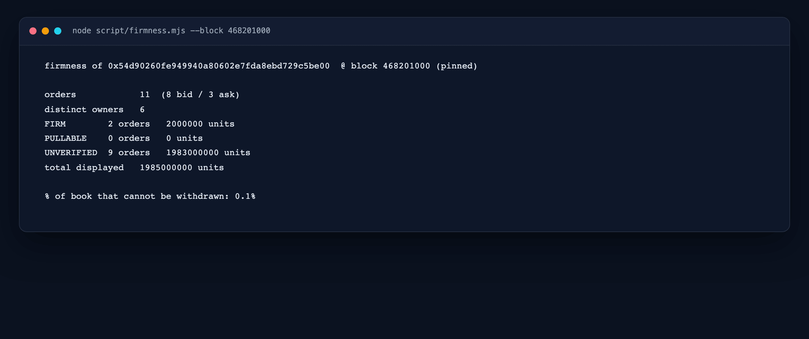
  <br><em><code>firmness.mjs --block 468201000</code> — pinned, so it prints these same numbers forever.</em>
</p>

### Verify the registry yourself

The ternary classifier is not only an off-chain script — it is **live on Shannon**, and its answers
are a public call away. No wallet, no gas:

```bash
REG=0x04aDbfC40dD10215Ee7b7D14B0aD74074a83f8C1
RPC=https://api.infra.testnet.somnia.network

cast call $REG "attester()(address)" --rpc-url $RPC
# 0xFbc73Ce1C0B43f87cD065f82df24697dEc653595   ← immutable; there is no setter

cast call $REG "classify(address)(uint8,bytes32,uint64)" \
  0x8116c3a4DE042D4A215B532B7C4054F36e074B68 --rpc-url $RPC
# 1 · 0xc60110e0…58b5 · 1787443200     [0 PULLABLE · 1 UNVERIFIED · 2 FIRM]
```

| | |
|---|---|
| Registry | [`0x04aDbfC4…f8C1`](https://shannon-explorer.somnia.network/address/0x04aDbfC40dD10215Ee7b7D14B0aD74074a83f8C1) · deploy [`0xedddeb8f…9e1d`](https://shannon-explorer.somnia.network/tx/0xedddeb8f93bafa7136cdf7975478e2cb3ba8a8f63009d809d069ee2f187a9e1d) |
| Attestation | [`0xe5f061f6…e69b`](https://shannon-explorer.somnia.network/tx/0xe5f061f6a36d9e1e1075d8868eed05e8f13fab7d94ba0920c29d292403dbe69b) — binds the LIVE `FirmQuote` runtime hash `0xc60110e0…58b5` |
| Record hash | `0xcecd1f5c…18b0` — keccak of `analyze()`'s full JSON, so the published reasoning cannot be swapped later |
| Full record | [`script/registry.deployed.json`](script/registry.deployed.json) |

**Read that `1` carefully — it says UNVERIFIED, and that is the point.** `S0`'s `unlockAt` was
2026-08-23 00:00 UTC and has lapsed, so a lock that no longer binds is not firm. The on-chain
classifier reaches exactly the same verdict as the off-chain engine, for exactly the same reason.
A registry that returned `FIRM` here would be the broken one.

The `attester` is an **immutable constructor argument** — no setter exists. The registry's honesty is
auditable rather than governed, and attestation remains a human-reviewed transparency list: a green
`analyze()` is a necessary pre-filter, never a proof of irrevocability.

---

## 📊 Engineering Rigor

### The headline number

```bash
node script/headline.mjs        # attested classifier 8/8  ·  naive EXTCODESIZE 2/8
```

The corpus is the real `FirmQuote`, **six attacker contracts that each look firm to a naive check**
(hidden cancel, EIP-1967 proxy, `DELEGATECALL`, late operator grant, quiet `reduceOrder`, and cancel
via an alternate selector), and a plain wallet. The attested-`EXTCODEHASH` classifier types all eight
correctly; the naive `EXTCODESIZE > 0` check is fooled by all six contract attacks. The whole corpus
is **deployed on Shannon**, and **five of the six escapes are executed as real transactions** — the
sixth (late operator grant) is rested on-chain with its exact blocked state documented. See
[DEMO.md](DEMO.md) and [`script/corpus.deployed.json`](script/corpus.deployed.json).

### Measured

| Metric | Value |
|---|---|
| Foundry tests | **93 passing, 0 failures** |
| `src/` coverage | **100%** line / statement / branch / function (168/168 lines) |
| Symbolic proofs | **5** (halmos) — quantify over every caller and every timestamp |
| Invariant campaigns | **3**, 128k call sequences over the bytecode's real dispatch surface |
| Off-chain checks | **17** (`node script/test.mjs`) |
| Sponsor-SDK differential | **35/35** (`npm run sdk-verify`) |
| Full-book retype | **p95 0.13 ms** on a deterministic 2,000-order book, inside a 100 ms block |
| Escapes executed on-chain | **5 of 6** |

<p align="center">
  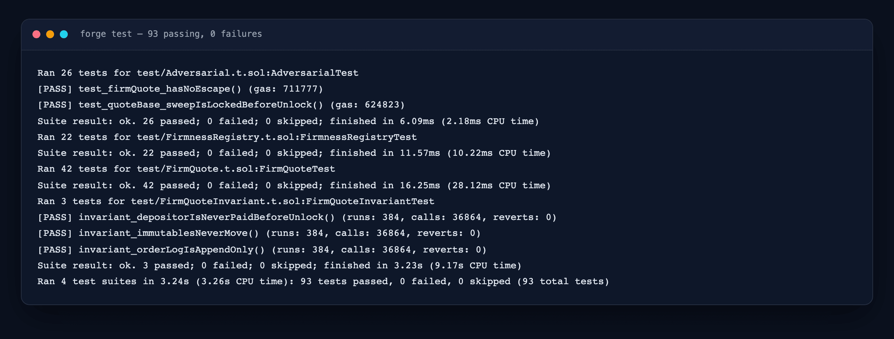
  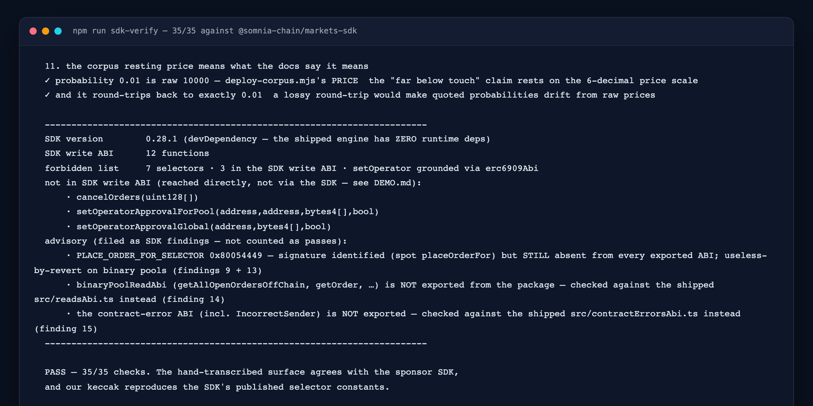
  <br><em><code>forge test</code> · <code>npm run sdk-verify</code> — neither number is transcribed by hand.</em>
</p>

### What each piece is

- `src/FirmQuote.sol` — a resting quote the pool will not let its funder withdraw. Buy-side only by
  design: a sell escrows outcome tokens, which needs an ERC-6909 `setOperator` grant, and granting
  no operator is what keeps the lock airtight. (42 unit tests incl. seven asserting the *absence* of
  every withdrawal selector, **3 invariant campaigns** over 128k call sequences, and **5 halmos
  symbolic proofs** — the security property is an absence, so it is attacked three different ways.)
- `src/FirmnessRegistry.sol` — the ternary classifier (**FIRM / PULLABLE / UNVERIFIED**) expressed as
  a Solidity contract: attested-`EXTCODEHASH` set + `classify` / `classifyBatch` with the lock-window
  horizon. (22 tests.) **Deployed and seeded on Shannon 2026-08-26** — see
  [Verify the registry yourself](#verify-the-registry-yourself).
- `src/adversarial/*.sol` — six attacker contracts, each with a real working escape proven against a
  faithful mock pool. (26 tests; every adversarial source file is at **100%** line, statement, branch
  and function coverage.)
- `script/` — the off-chain engine: a dependency-free `keccak256`, an EVM disassembler + static
  bytecode policy (`analyze`), the FIRM/PULLABLE/UNVERIFIED classifier, the **headline** comparison,
  the **firmness %** over a live market, and the **bench**. `node script/test.mjs` → 17 checks,
  including four that pin the analyzer's known evasions; the analyzer's hash matches on-chain
  `EXTCODEHASH`.
- `src/IBinaryPool.sol` — the pool surface, transcribed from `@somnia-chain/markets-sdk`, and
  **checked against it in CI** by `script/sdk-verify.mjs` (35/35).
- `gate.sh` — the day-1 go/no-go against Somnia Shannon testnet. **Run 2026-08-19: PASSED.**

**Honest edges** (detailed in [DEMO.md](DEMO.md) → *Honest limits*): five of the six attacker escapes
execute a full on-chain withdrawal; the sixth — the operator-grant — has its grant executed and
verifiable in the registry, but the binary pool rejects `cancelOrderFor` from **any** operator, so
that route cannot withdraw here. That is a finding about the pool, not a gap we papered over, and the
mechanism is proven in unit tests. The 8/8-vs-2/8 classification is computed from **live on-chain
EXTCODEHASH** and does not depend on the escapes running.

---

## 🚀 Getting Started

### Prerequisites

| | | |
|---|---|---|
| [Foundry](https://book.getfoundry.sh/getting-started/installation) | `forge` ≥ 0.2 | contracts + tests |
| [Node.js](https://nodejs.org) | ≥ 20 | the off-chain engine (uses global `fetch`) |
| `git` | any | submodules — `forge-std` is vendored as one |

### Installation

```bash
# 1. Clone WITH submodules (lib/forge-std is a submodule — a plain clone will not build)
git clone --recurse-submodules https://github.com/edycutjong/rampart.git
cd rampart
# already cloned without them?  git submodule update --init --recursive

# 2. Install Foundry, if you do not have it
curl -L https://foundry.paradigm.xyz | bash && foundryup

# 3. Contracts: build + test  → 93 passing, 0 failures
forge build
forge test

# 4. Off-chain engine: dev deps only, the engine itself has ZERO runtime dependencies
npm ci
```

No API key, no wallet, and no funds are needed for any of the above — every command is offline or
read-only. **Optional**, only if you want to re-run the on-chain gate yourself:

```bash
export SOMNIA_TESTNET_RPC=https://api.infra.testnet.somnia.network   # the default; override to use your own
export PRIVATE_KEY=0x…                                              # a funded Shannon key — ONLY for ./gate.sh
```

### Troubleshooting

| Symptom | Cause | Fix |
|---|---|---|
| `Source "forge-std/Test.sol" not found` | cloned without submodules | `git submodule update --init --recursive` |
| `headline.mjs --live` prints 7/8 and exits 1 | S0's lock lapsed 2026-08-23 — correct behaviour | add `--block 468201000` |
| `firmness.mjs` exits 1 with "0 resting orders" | the testnet pool has cycled | `--block 468201000`, or `node script/find-pool.mjs` for a live one |
| pinned run reports "block PREDATES its deployment" | pinned earlier than the corpus deploy | pin ≥ `468201000` |

---

## 🧪 Testing & CI

```bash
forge test                       # 93 passing
npm run prove                    # 5 symbolic proofs (halmos)
npm run verify                   # syntax + lint + typecheck + 17 off-chain checks + sdk 35/35 + headline 8/8

# The live classifier, pinned so it reproduces exactly (Somnia's public RPC is archival):
node script/headline.mjs --live --block 468201000   # 8/8 attested vs 2/8 naive, off-chain EXTCODEHASH
node script/firmness.mjs --block 468201000          # 11 orders, 2 FIRM → 0.1% of the book is firm

PRIVATE_KEY=0x… POOL=0x… ./gate.sh   # the day-1 gate — steps 4 and 5 SUCCEED BY REVERTING
```

`gate.sh` step 4 has the funding wallet attempt `pool.cancelOrder` on the contract's own order. That
transaction is **supposed to fail**, and the failed transaction on the explorer is the proof — an
artifact that cannot be mocked.

CI runs six stages on every push: contracts, a ≥80% coverage gate, the classifier self-test, lint +
typecheck + the sponsor-SDK differential, the 100 ms bench gate, and a **pinned live on-chain proof**
that asserts 8/8 against Shannon. Slither, CodeQL, gitleaks over the full history, and Dependabot run
alongside.

---

## 📽️ Demo Materials

| | |
|---|---|
| 🎬 Demo video (2:44) | **[youtu.be/DhxuWFHOsyM](https://youtu.be/DhxuWFHOsyM)** |
| 🚀 Live site | **[rampart.edycu.dev](https://rampart.edycu.dev)** |
| 📖 Typed-book viewer | **[rampart.edycu.dev/viewer](https://rampart.edycu.dev/viewer/)** |
| 📊 Pitch deck | **[rampart.edycu.dev/pitch](https://rampart.edycu.dev/pitch/)** |
| 🔍 Full evidence trail | **[DEMO.md](DEMO.md)** |

<p align="center">
  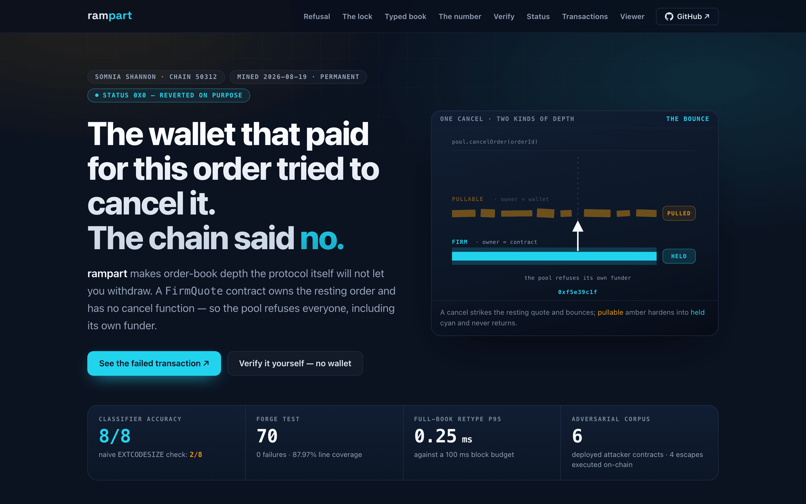
  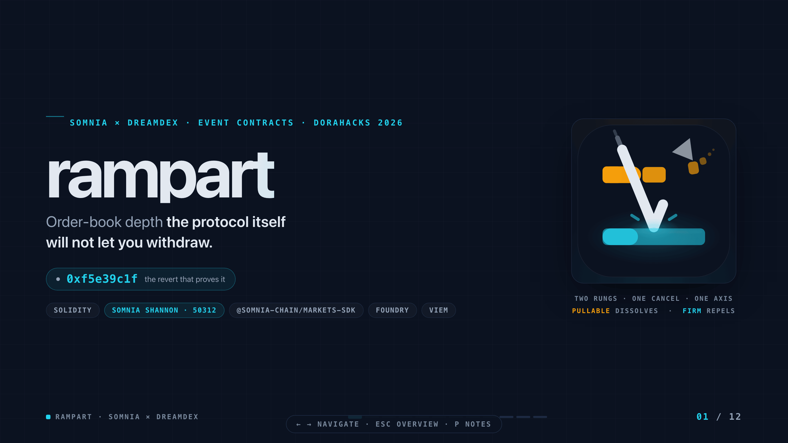
  <br><em><a href="https://rampart.edycu.dev">rampart.edycu.dev</a> · <a href="https://rampart.edycu.dev/pitch/">the deck</a></em>
</p>

Every command in the video was really run and captured raw; the terminal scenes are frame-stepped
replays of those captures, **labelled on screen as replays**. Nothing is sped up, and no result is
staged.

---

## 📄 License

MIT — see [LICENSE](LICENSE).
