<p align="center">
  
</p>

<p align="center">
  <strong>Order-book depth the protocol itself will not let you withdraw.</strong>
</p>

<p align="center">
  <code>Solidity</code> · <code>Somnia</code> · <code>@somnia-chain/markets-sdk</code> · <code>Foundry</code> · <code>viem</code>
</p>

---

## The mechanism

A `FirmQuote` contract holds collateral, approves a Somnia `BinaryPool`, and calls
`placeBinaryOrder` — so the resulting **`Order.owner` is the contract, not a wallet**.

The contract exposes **no cancel path, no reduce path, and never grants an operator**. Every route
that could withdraw the resting order is therefore closed:

| Withdrawal path | Who may call it | Source |
|---|---|---|
| `cancelOrder(uint128)` | the order owner **only** — a non-owner reverts `IncorrectSender` `0xf5e39c1f` | [errors](https://docs.dreamdex.io/developers/contracts/errors) |
| `cancelOrderFor(owner, id)` | an operator the **owner** approved. *"Unlike `placeOrderFor`, the system-contract allowlist does **not** admit callers here — only the owner's per-user approval does."* | [functions](https://docs.dreamdex.io/developers/contracts/functions) |
| `reduceOrderFor(owner, id, qty)` | *"Per-user approval only (no system allowlist)."* | [functions](https://docs.dreamdex.io/developers/contracts/functions) |

The quote stands until a taker fills it or its mandatory `expireTimestampNs` lapses. **Not even the
wallet that paid for it can take it back.**

### Why that matters

`Order.owner` is readable on-chain, so every price level can be **typed**:

| | condition | claim |
|---|---|---|
| **FIRM** | owner is a contract whose `EXTCODEHASH` is attested, still inside its lock window | this depth cannot be withdrawn |
| **PULLABLE** | owner is a wallet | this depth can vanish in one block |
| **UNVERIFIED** | owner is a contract we have not attested | *no claim is made* |

"Percent of book that cannot be withdrawn" is a liquidity-quality observable that **exists on no
other exchange**. Off-chain books — Polymarket, Kalshi, every CEX — cannot expose it: their resting
orders are signed messages inside a private matching engine, with no on-chain owner to inspect.

> `UNVERIFIED` is load-bearing. Classifying on `EXTCODESIZE > 0` alone is forgeable — a contract can
> hide a cancel, sit behind an upgradeable proxy, `DELEGATECALL` to an attacker target, or grant an
> operator *after* resting. All four would display as FIRM under a naive check. An attacker cannot
> mint fake FIRM depth, only UNVERIFIED depth.

---

## Status — honest, day 1

This repository is **early**. What is here is real; what is not here is named.

**Built and passing**

- `src/FirmQuote.sol` — the contract above. Buy-side only by design: a sell escrows outcome tokens,
  which needs an ERC-6909 `setOperator` grant, and granting no operator is what keeps the lock airtight.
- `src/IBinaryPool.sol` — the pool surface, transcribed from `@somnia-chain/markets-sdk@0.27.0`.
- `test/FirmQuote.t.sol` — **42 tests, 0 failures** (`forge test`), including seven that assert the
  *absence* of every withdrawal selector. What is missing is the product.
- `gate.sh` — the day-1 go/no-go against Somnia Shannon testnet. **Run 2026-08-19: PASSED.**

**Not built yet** — these are specified, not shipped, and this section will shrink as they land:

- the typed-book classifier and the attested-codehash registry
- the adversarial corpus that proves the classification
- ~~any deployment, and therefore any on-chain proof~~ — **done**, see DEMO.md

### ✅ Proven on-chain — 2026-08-19

**The gate passed.** A `BinaryPool` accepts a contract as `Order.owner`, and the funder cannot take
the order back. Order `…9685` rested with real escrow while its own funder's cancel **reverted**:

```
0xf5e39c1f  IncorrectSender(
  caller   = 0xFbc73Ce1…3595   ← the wallet that paid for the order
  expected = 0x2a09b4c4…191a   ← FirmQuote
)
```

The failed transaction is public and permanent:
**[`0x959b4770…6ddb`](https://shannon-explorer.somnia.network/tx/0x959b47704d493dd48f2e724f2692facf1609a2cdc738f1a7ceb1fd070b3c6ddb)** (status `0x0`).
Control: the same call `--from` the contract returns `0x` — the pool *would* allow its owner to
cancel; the owner simply has no code path to ask.

Full evidence, including why the first attempt was invalid and was re-run: **[DEMO.md](DEMO.md)**.

Verify it yourself with no wallet, no funds, no gas:

```bash
cast call 0x1b8ed5380a4741df019acf5faa0ce6ecbf6167ee "cancelOrder(uint128)" \
  129127208515966879685 --from 0xFbc73Ce1C0B43f87cD065f82df24697dEc653595 \
  --rpc-url https://api.infra.testnet.somnia.network
```

```bash
forge test                       # 42 passing
PRIVATE_KEY=0x… POOL=0x… ./gate.sh   # the day-1 gate — steps 4 and 5 SUCCEED BY REVERTING
```

`gate.sh` step 4 has the funding wallet attempt `pool.cancelOrder` on the contract's own order. That
transaction is **supposed to fail**, and the failed transaction on the explorer is the proof — an
artifact that cannot be mocked.

---

## Notes for anyone building on Somnia binary markets

Two things cost real time and neither is in the prose docs, which document `SpotPool`:

1. **A binary pool has `placeBinaryOrder`, not `placeOrder`.** The generic entry point reverts
   `UseBinaryPlacement`. The YES/NO side is an explicit `kind` param and `price` is *always* quoted
   in YES terms.
2. **`builderFeeBpsTimes1k` must be `uint96`.** It is selector-critical — a `uint256` there produces
   a different function selector and the call reverts with nothing decodable.

Both were read out of `markets-sdk/src/tradeAbi.ts`, not the documentation.

## License

MIT
